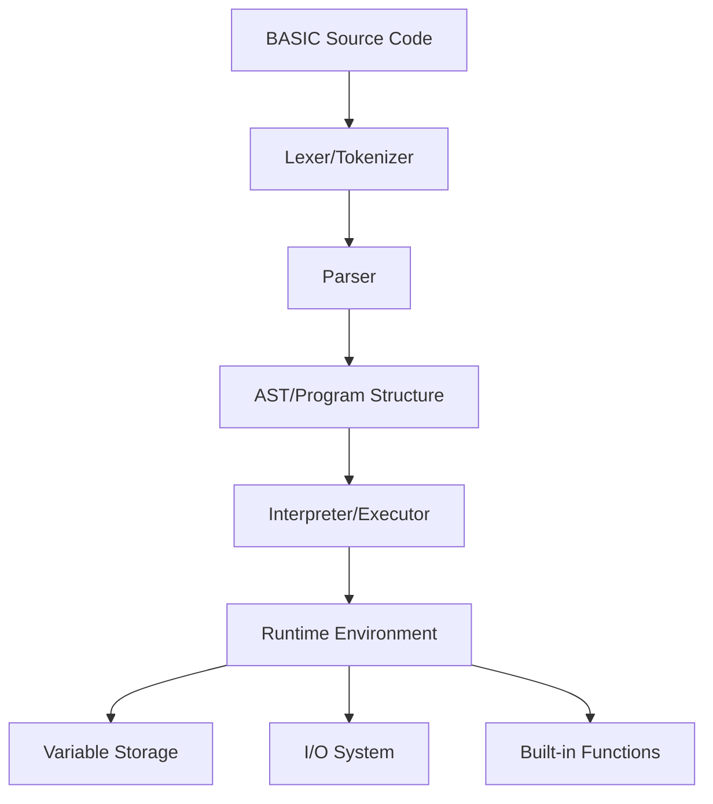

# Design Document

## Overview

The BASIC interpreter will be implemented using a traditional interpreter architecture with distinct phases: lexical analysis (tokenization), parsing, and execution. The design follows the interpreter pattern with a tree-walking evaluator that executes BASIC statements directly without compilation to bytecode.

The interpreter will support line-numbered BASIC programs and maintain program state including variables, program counter, and call stack for nested control structures.

## Architecture



### Core Components

1. **Lexer**: Converts source code into tokens
2. **Parser**: Builds program structure from tokens
3. **Interpreter**: Executes parsed program
4. **Runtime Environment**: Manages program state and execution context
5. **Variable System**: Handles variable storage and type management
6. **I/O System**: Manages input/output operations

## Components and Interfaces

### Lexer/Tokenizer
```go
type TokenType int
type Token struct {
    Type    TokenType
    Value   string
    Line    int
    Column  int
}

type Lexer interface {
    NextToken() Token
    HasMoreTokens() bool
}
```

**Responsibilities:**
- Convert source code into stream of tokens
- Handle BASIC keywords, operators, literals, and identifiers
- Track line and column numbers for error reporting
- Support both numeric and string literals

### Parser
```go
type Statement interface {
    Execute(env *Environment) error
}

type Expression interface {
    Evaluate(env *Environment) (Value, error)
}

type Parser interface {
    ParseProgram() (*Program, error)
    ParseStatement() (Statement, error)
    ParseExpression() (Expression, error)
}
```

**Responsibilities:**
- Parse tokens into executable statements
- Build expression trees for arithmetic and logical operations
- Handle BASIC-specific syntax (line numbers, statement separators)
- Validate syntax and report parsing errors

### Program Structure
```go
type Program struct {
    Lines map[int]Statement  // Line number -> Statement mapping
    Order []int              // Ordered list of line numbers
}

type Environment struct {
    Variables    map[string]Value
    ProgramCounter int
    CallStack    []int
    ForLoops     []ForLoopState
    RandomSeed   int64
}
```

**Responsibilities:**
- Store program as line-numbered statements
- Maintain execution state and variable storage
- Handle nested control structures (FOR loops, subroutines)
- Provide random number generation state

### Value System
```go
type ValueType int
type Value struct {
    Type     ValueType
    NumValue float64
    StrValue string
}

const (
    NumericValue ValueType = iota
    StringValue
)
```

**Responsibilities:**
- Handle both numeric and string values
- Provide type conversion and validation
- Support BASIC's loose typing system

### Statement Types

**Assignment Statement**
```go
type AssignmentStatement struct {
    Variable string
    Expression Expression
}
```

**Print Statement**
```go
type PrintStatement struct {
    Expressions []Expression
    Separator   string
}
```

**Input Statement**
```go
type InputStatement struct {
    Prompt   string
    Variable string
}
```

**Control Flow Statements**
```go
type GotoStatement struct {
    LineNumber int
}

type IfStatement struct {
    Condition Expression
    ThenStatement Statement
}

type ForStatement struct {
    Variable   string
    StartExpr  Expression
    EndExpr    Expression
    StepExpr   Expression
}

type NextStatement struct {
    Variable string
}
```

### Built-in Functions
```go
type BuiltinFunction interface {
    Call(args []Value) (Value, error)
    Name() string
    ArgCount() int
}
```

**Supported Functions:**
- `ABS(x)` - Absolute value
- `INT(x)` - Integer part
- `RND` - Random number 0-1
- `LEN(s)` - String length
- `MID$(s, start, length)` - Substring
- `STR$(x)` - Number to string
- `VAL(s)` - String to number

## Data Models

### Token Model
- **Type**: Keyword, Identifier, Number, String, Operator, etc.
- **Value**: The actual text or parsed value
- **Position**: Line and column for error reporting

### Variable Model
- **Name**: Variable identifier (case-insensitive)
- **Type**: Numeric or String (determined by $ suffix)
- **Value**: Current value with appropriate type

### Program Model
- **Lines**: Map of line numbers to parsed statements
- **Execution Order**: Sorted list of line numbers
- **Current Line**: Program counter for execution

## Error Handling

### Error Types
1. **Lexical Errors**: Invalid characters, unterminated strings
2. **Syntax Errors**: Invalid statement structure, missing keywords
3. **Runtime Errors**: Division by zero, undefined variables, type mismatches
4. **Logic Errors**: GOTO to non-existent line, unmatched FOR/NEXT

### Error Reporting
```go
type BasicError struct {
    Type    ErrorType
    Message string
    Line    int
    Column  int
}
```

**Error Handling Strategy:**
- Stop execution on first error encountered
- Provide clear error messages with line numbers
- Distinguish between compile-time and runtime errors
- Support optional debug mode for step-by-step execution

## Testing Strategy

### Unit Testing
- **Lexer Tests**: Token generation for various input types
- **Parser Tests**: Statement and expression parsing
- **Interpreter Tests**: Individual statement execution
- **Built-in Function Tests**: Each function with various inputs

### Integration Testing
- **Program Execution**: Complete BASIC programs with expected outputs
- **Error Scenarios**: Programs with various types of errors
- **Control Flow**: Complex programs with loops and conditionals
- **I/O Testing**: Programs requiring user input

### Test Program Examples
```basic
10 PRINT "Hello, World!"
20 FOR I = 1 TO 10
30 PRINT I
40 NEXT I
50 END
```

```basic
10 INPUT "Enter a number: "; N
20 IF N > 0 THEN PRINT "Positive"
30 IF N < 0 THEN PRINT "Negative"  
40 IF N = 0 THEN PRINT "Zero"
50 END
```

### Performance Considerations
- Use efficient data structures for line number lookups
- Minimize memory allocation during execution
- Cache parsed expressions where possible
- Implement reasonable limits to prevent infinite loops

### Command Line Interface
```go
type CLI struct {
    DebugMode    bool
    Interactive  bool
    InputFile    string
}
```

**Features:**
- File execution mode: `basic-interpreter program.bas`
- Interactive mode: `basic-interpreter` (no arguments)
- Debug mode: `basic-interpreter -debug program.bas`
- Help: `basic-interpreter -help`