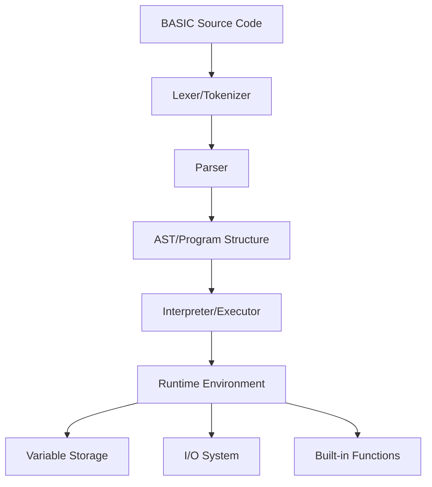

# Design Document

## Overview

The BASIC interpreter will be implemented using Test-Driven Development (TDD) methodology with a traditional interpreter architecture. Each component will be developed following the red-green-refactor cycle: write failing tests first, implement minimal code to pass tests, then refactor while keeping tests green.

The architecture includes distinct phases: lexical analysis (tokenization), parsing, and execution. The design follows the interpreter pattern with a tree-walking evaluator that executes BASIC statements directly without compilation to bytecode.

The interpreter will support line-numbered BASIC programs and maintain program state including variables, program counter, and call stack for nested control structures.

## Technology Stack

### Programming Language
- **Go 1.21+**: Primary implementation language for performance and simplicity

### Testing Framework
- **stretchr/testify**: Required testing framework for all tests
  - Use `assert` package for test assertions
  - Use `require` package for test requirements that should stop execution on failure
  - Use `mock` package for creating test doubles when needed
  - Use `suite` package for complex test scenarios requiring setup/teardown

### Testing Standards
All test files must use testify assertions instead of Go's built-in testing functions:

```go
import (
    "testing"
    "github.com/stretchr/testify/assert"
    "github.com/stretchr/testify/require"
)

// Required - Use testify assertions
assert.Equal(t, expected, actual)
assert.NoError(t, err)
require.NotNil(t, result)

// Avoid - Don't use built-in testing functions
if expected != actual {
    t.Errorf("Expected %v, got %v", expected, actual)
}
```

### Dependencies
- **Standard Library Only**: Core implementation uses only Go standard library
- **testify**: Only external dependency, used exclusively for testing

### Development Guidelines
- **Git Commits**: When committing code changes, always include Kiro as co-author using:
  ```
  Co-authored-by: Kiro <kiro@kiro.ai>
  ```

## Architecture



### Core Components

1. **Lexer**: Converts source code into tokens
2. **Parser**: Builds program structure from tokens
3. **Interpreter**: Executes parsed program
4. **Runtime Environment**: Manages program state and execution context
5. **Variable System**: Handles variable storage and type management
6. **I/O System**: Manages input/output operations

## Components and Interfaces

### Lexer/Tokenizer
```go
type TokenType int
type Token struct {
    Type    TokenType
    Value   string
    Line    int
    Column  int
}

type Lexer interface {
    NextToken() Token
    HasMoreTokens() bool
}
```

**Responsibilities:**
- Convert source code into stream of tokens
- Handle BASIC keywords, operators, literals, and identifiers
- Track line and column numbers for error reporting
- Support both numeric and string literals

### Parser
```go
type Statement interface {
    Execute(env *Environment) error
}

type Expression interface {
    Evaluate(env *Environment) (Value, error)
}

type Parser interface {
    ParseProgram() (*Program, error)
    ParseStatement() (Statement, error)
    ParseExpression() (Expression, error)
}
```

**Responsibilities:**
- Parse tokens into executable statements
- Build expression trees for arithmetic and logical operations
- Handle BASIC-specific syntax (line numbers, statement separators)
- Validate syntax and report parsing errors

### Program Structure
```go
type Program struct {
    Lines map[int]Statement  // Line number -> Statement mapping
    Order []int              // Ordered list of line numbers
}

type Environment struct {
    Variables    map[string]Value
    ProgramCounter int
    CallStack    []int
    ForLoops     []ForLoopState
    RandomSeed   int64
}
```

**Responsibilities:**
- Store program as line-numbered statements
- Maintain execution state and variable storage
- Handle nested control structures (FOR loops, subroutines)
- Provide random number generation state

### Value System
```go
type ValueType int
type Value struct {
    Type     ValueType
    NumValue float64
    StrValue string
}

const (
    NumericValue ValueType = iota
    StringValue
)
```

**Responsibilities:**
- Handle both numeric and string values
- Provide type conversion and validation
- Support BASIC's loose typing system

### Statement Types

**Assignment Statement**
```go
type AssignmentStatement struct {
    Variable string
    Expression Expression
}
```

**Print Statement**
```go
type PrintStatement struct {
    Expressions []Expression
    Separator   string
}
```

**Input Statement**
```go
type InputStatement struct {
    Prompt   string
    Variable string
}
```

**Control Flow Statements**
```go
type GotoStatement struct {
    LineNumber int
}

type IfStatement struct {
    Condition Expression
    ThenStatement Statement
}

type ForStatement struct {
    Variable   string
    StartExpr  Expression
    EndExpr    Expression
    StepExpr   Expression
}

type NextStatement struct {
    Variable string
}
```

### Built-in Functions
```go
type BuiltinFunction interface {
    Call(args []Value) (Value, error)
    Name() string
    ArgCount() int
}
```

**Supported Functions:**
- `ABS(x)` - Absolute value
- `INT(x)` - Integer part
- `RND` - Random number 0-1
- `LEN(s)` - String length
- `MID$(s, start, length)` - Substring
- `STR$(x)` - Number to string
- `VAL(s)` - String to number

## Data Models

### Token Model
- **Type**: Keyword, Identifier, Number, String, Operator, etc.
- **Value**: The actual text or parsed value
- **Position**: Line and column for error reporting

### Variable Model
- **Name**: Variable identifier (case-insensitive)
- **Type**: Numeric or String (determined by $ suffix)
- **Value**: Current value with appropriate type

### Program Model
- **Lines**: Map of line numbers to parsed statements
- **Execution Order**: Sorted list of line numbers
- **Current Line**: Program counter for execution

## Error Handling

### Error Types
1. **Lexical Errors**: Invalid characters, unterminated strings
2. **Syntax Errors**: Invalid statement structure, missing keywords
3. **Runtime Errors**: Division by zero, undefined variables, type mismatches
4. **Logic Errors**: GOTO to non-existent line, unmatched FOR/NEXT

### Error Reporting
```go
type BasicError struct {
    Type    ErrorType
    Message string
    Line    int
    Column  int
}
```

**Error Handling Strategy:**
- Stop execution on first error encountered
- Provide clear error messages with line numbers
- Distinguish between compile-time and runtime errors
- Support optional debug mode for step-by-step execution

## TDD Testing Strategy

### Test-First Development Process

**Red-Green-Refactor Cycle:**
1. **Red**: Write a failing test that defines desired behavior
2. **Green**: Write minimal code to make the test pass
3. **Refactor**: Improve code design while keeping tests green

### Unit Testing (Test-First)

**Lexer Tests (Write Before Implementation):**
- Token generation for keywords, identifiers, numbers, strings
- Error handling for invalid characters and unterminated strings
- Line and column tracking for error reporting
- Edge cases: empty input, whitespace handling, comment parsing

**Parser Tests (Write Before Implementation):**
- Statement parsing for each BASIC statement type
- Expression parsing with operator precedence
- Error recovery and reporting for syntax errors
- Line number handling and program structure validation

**Interpreter Tests (Write Before Implementation):**
- Individual statement execution with mocked environment
- Variable assignment and retrieval
- Arithmetic operations and type conversions
- Control flow changes (program counter manipulation)

**Built-in Function Tests (Write Before Implementation):**
- Each function with valid inputs and expected outputs
- Error handling for invalid argument types and counts
- Edge cases: empty strings, zero values, boundary conditions

### Integration Testing (Test-First)

**Program Execution Tests:**
- Complete BASIC programs with expected outputs
- Programs using mocked I/O for predictable testing
- Complex programs combining multiple language features

**Error Scenario Tests:**
- Programs with syntax errors (test error messages)
- Programs with runtime errors (test error reporting)
- Programs with logic errors (GOTO to invalid lines)

**Control Flow Tests:**
- Nested FOR loops with proper variable scoping
- Complex conditional logic with multiple IF statements
- GOTO statements with forward and backward jumps

### Test Program Examples

**Basic Hello World Test:**
```go
func TestHelloWorld(t *testing.T) {
    program := `10 PRINT "Hello, World!"`
    expected := "Hello, World!\n"
    
    output := executeProgram(t, program)
    assert.Equal(t, expected, output)
}
```

**Loop Test:**
```go
func TestForLoop(t *testing.T) {
    program := `
10 FOR I = 1 TO 3
20 PRINT I
30 NEXT I`
    expected := "1\n2\n3\n"
    
    output := executeProgram(t, program)
    assert.Equal(t, expected, output)
}
```

**Error Handling Test:**
```go
func TestSyntaxError(t *testing.T) {
    program := `10 PRINT "Unterminated string`
    
    _, err := parseProgram(program)
    assert.Error(t, err)
    assert.Contains(t, err.Error(), "unterminated string")
    assert.Contains(t, err.Error(), "line 10")
}
```

### TDD Implementation Guidelines

**Test Organization:**
- One test file per component (lexer_test.go, parser_test.go, etc.)
- Group related tests using subtests
- Use table-driven tests for multiple similar scenarios
- Mock external dependencies (I/O, file system)

**Test Naming Convention:**
- `TestComponentName_Scenario_ExpectedBehavior`
- Example: `TestLexer_NumberToken_ReturnsCorrectValue`

**Test Data Management:**
- Use test fixtures for complex BASIC programs
- Create helper functions for common test setup
- Use golden files for large expected outputs

**Continuous Refactoring:**
- Refactor after each green test
- Extract common functionality into helper functions
- Improve error messages and code clarity
- Maintain test coverage above 90%

### Performance Testing (After Core Functionality)
- Benchmark tests for lexer performance
- Memory usage tests for large programs
- Execution time limits for infinite loop detection
- Stress tests with deeply nested control structures

### Command Line Interface
```go
type CLI struct {
    DebugMode    bool
    Interactive  bool
    InputFile    string
}
```

**Features:**
- File execution mode: `basic-interpreter program.bas`
- Interactive mode: `basic-interpreter` (no arguments)
- Debug mode: `basic-interpreter -debug program.bas`
- Help: `basic-interpreter -help`

## TDD Design Principles

### Testable Architecture

**Dependency Injection:**
- Inject I/O interfaces to enable mocking in tests
- Use interfaces for file system operations
- Separate pure logic from side effects

**Interface Design:**
```go
type InputReader interface {
    ReadLine() (string, error)
}

type OutputWriter interface {
    WriteLine(string) error
}

type FileSystem interface {
    ReadFile(filename string) ([]byte, error)
}
```

### Test-Driven Component Design

**Lexer Design for Testing:**
- Accept input as string or io.Reader for flexibility
- Return tokens one at a time for easy testing
- Include position information for error testing
- Separate tokenization logic from input handling

**Parser Design for Testing:**
- Accept token stream as input (not raw source)
- Return structured AST for verification
- Separate parsing logic from execution
- Include comprehensive error information

**Interpreter Design for Testing:**
- Accept parsed program and environment
- Use dependency injection for I/O operations
- Return execution results and final state
- Enable step-by-step execution for debugging tests

### Mock and Stub Strategy

**I/O Mocking:**
```go
type MockInputReader struct {
    inputs []string
    index  int
}

func (m *MockInputReader) ReadLine() (string, error) {
    if m.index >= len(m.inputs) {
        return "", io.EOF
    }
    result := m.inputs[m.index]
    m.index++
    return result, nil
}
```

**Output Capture:**
```go
type MockOutputWriter struct {
    outputs []string
}

func (m *MockOutputWriter) WriteLine(line string) error {
    m.outputs = append(m.outputs, line)
    return nil
}
```

### Test Data Organization

**Test Fixtures:**
- Store complex BASIC programs in separate files
- Use embedded file system for test data
- Create program builders for dynamic test cases

**Helper Functions:**
```go
func executeProgram(t *testing.T, source string) string {
    lexer := NewLexer(source)
    parser := NewParser(lexer)
    program, err := parser.ParseProgram()
    require.NoError(t, err)
    
    output := &MockOutputWriter{}
    input := &MockInputReader{}
    interpreter := NewInterpreter(output, input)
    
    err = interpreter.Execute(program)
    require.NoError(t, err)
    
    return strings.Join(output.outputs, "\n")
}
```

### Incremental Development Strategy

**Phase 1: Core Infrastructure**
- Write tests for basic token types
- Implement minimal lexer
- Write tests for simple expressions
- Implement basic parser

**Phase 2: Basic Operations**
- Write tests for variable assignment
- Implement variable storage
- Write tests for arithmetic operations
- Implement expression evaluation

**Phase 3: Control Flow**
- Write tests for GOTO functionality
- Implement program counter management
- Write tests for conditional statements
- Implement IF-THEN logic

**Phase 4: Advanced Features**
- Write tests for loops and functions
- Implement FOR-NEXT and built-ins
- Write tests for I/O operations
- Implement PRINT and INPUT

This incremental approach ensures each feature is fully tested before moving to the next, maintaining a stable codebase throughout development.